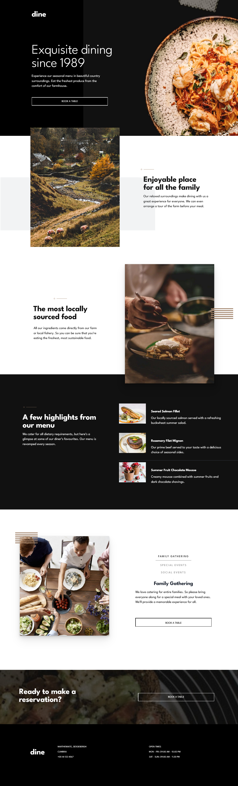
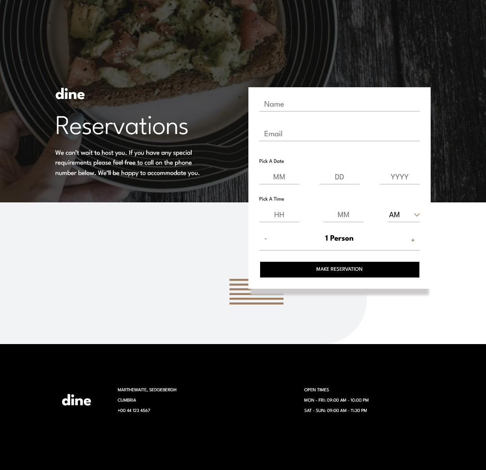

# Frontend Mentor - Dine Website Challenge

## Table of contents

- [Overview](#overview)
  - [The challenge](#the-challenge)
  - [Screenshot](#screenshot)
- [My process](#my-process)
  - [Built with](#built-with)
  - [What I learned](#what-i-learned)
  - [Continued development](#continued-development)
  - [Useful resources](#useful-resources)
- [Author](#author)
- [Acknowledgments](#acknowledgments)

## Overview

### The challenge

Users should be able to:

- View the optimal layout for each page depending on their device's screen size
- See hover states for all interactive elements throughout the site
- See the correct content for the Family Gatherings, Special Events, and Social Events section when the user clicks each tab
- Receive an error message when the booking form is submitted if:
  - The `Name` or `Email Address` fields are empty should show "This field is required"
  - The `Email Address` is not formatted correctly should show "Please use a valid email address"
  - Any of the `Pick a date` or `Pick a time` fields are empty should show "This field is incomplete"

### Screenshot

## My process

### Built with

HTML

- Semantic HTML5 markup
- Template driven forms

CSS

- Mobile-first workflow
- Sass
- Flexbox

Javascript

- [AngularJS](https://angularjs.org/) - JS library

### What I learned

What I learned is I had to be very vigilant about how to implement complex responsive designs and keeping that in mind with the mobile-first workflow. It's hard to reorganize content without proper container setup (2D Flexbox design) and the necessary planning. I regretfully made
the mobile design first then had to redesign it all after realizing making the tablet responsive design that I'd need some additional containers for the desktop responsive design.

I also learned the differnce between template driven forms and reactive forms and the interfaces implemented underneath the hood that allow 
reactive forms to work in Angular. It's quite complicated to get custom behavior and validation rules for native HTML forms unless I read the 
documentation for these interfaces and sometimes keeping it simple can save a lot of headache from (unnecessary) hand coded form design. 

There is a lot of frustration implementing a very beautiful design that doesn't conform 1:1 to Material Design (Bootstrap, etc)
because the developers put in a lot of thought in how the components are wired, validated and how they appear in responsive design.
I learned that simple changes on the front end can be a lot more of a nightmare to implement at the UI level and it's mindblowing
how elegant some solutions can be on StackOverflow and in the FrontEndMentor community.

### Continued development

I used a Figma design document to implement the design and I missed a few details that ended up making the CSS a lot messier.
Also the event portion of the homepage needs to be implemented such that it reacts or self scrolls like a jumbotron. There is also
no internal admin panel or backend that stores the reservations and I do not wish to just throw all of the JSON onto local storage.
It isn't part of the specification of the challenge but what's the point of having a reservation app without being able to look at them :).

Some of the component dimensions also don't match the specifications of the Figma design.

TLDR:

1. Fix CSS / Mixins
2. Implement Events such that they move on click and/or rotate over time like a jumbotron
3. Match the Design 1-to-1
4. Consider implementing and learning more ways to safeguard the application with both front-end and backend validation
5. Creating a backend for administrators to look at the reservations

### Useful resources

- [MDN Web Docs - Responsive Images](https://developer.mozilla.org/en-US/docs/Learn/HTML/Multimedia_and_embedding/Responsive_images) - Responsive images are a lot more complex and have multiple solutions depending on if you use Flexbox, Grid, or your flavor of organizing your web content.
- [Angular Forms on Angular.io](https://angular.io/guide/forms) - This is a concise resource on how to implement both template driven forms and reactive forms.

## Author

- Github - [zoren2](https://github.com/zoren2)

## Acknowledgments

This gave me a lot more pleasure and headache than I thought it would. I knocked out most of the responsive designs within 2 hours
then ended up banging my head on what I thought would be the easiest part - the forms. It gets hairy once the designs don't map directly
to Material Design components :( - shoutout to MDN Web Docs.
