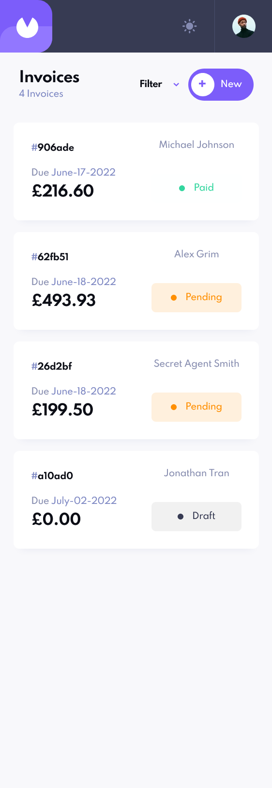
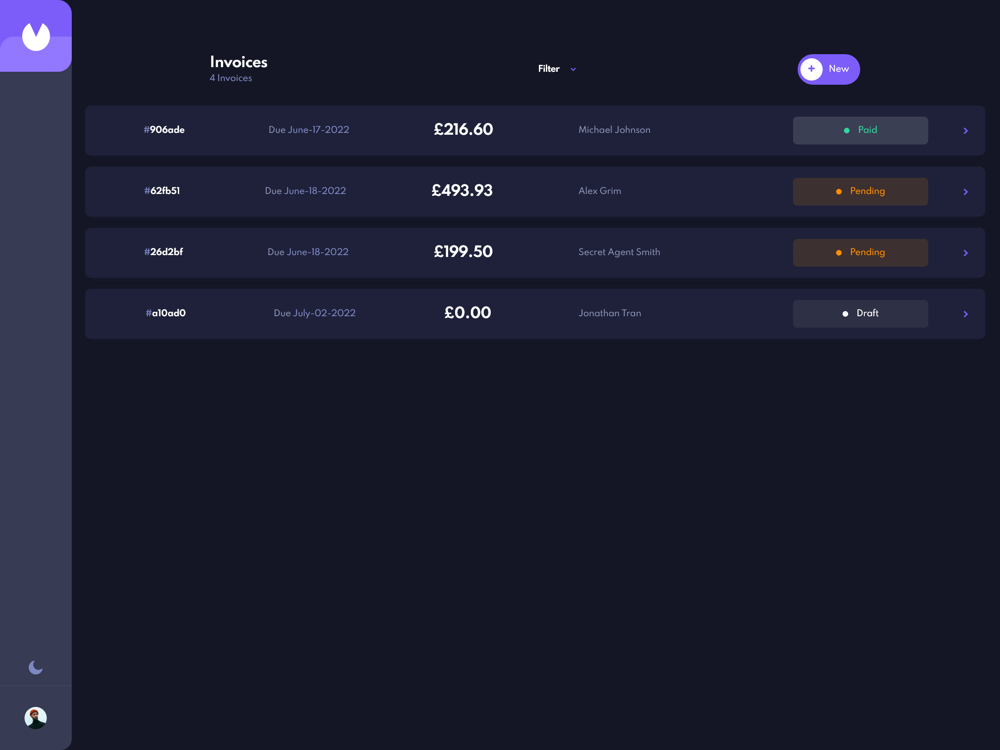
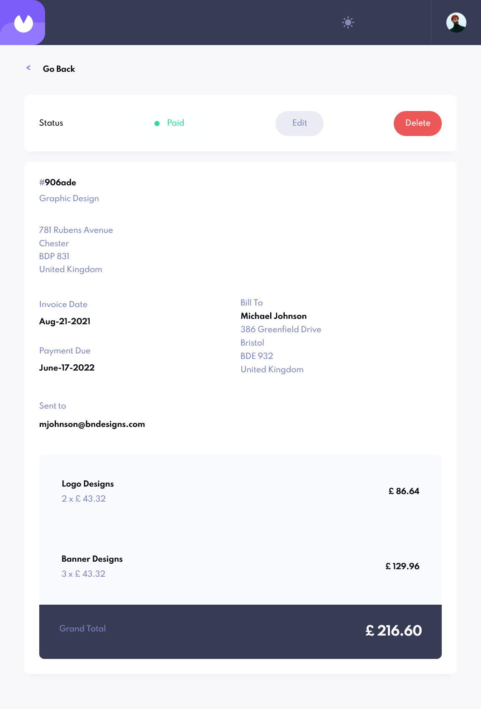

# Frontend Mentor - Invoice app solution

## Table of contents

- [Overview](#overview)
  - [The challenge](#the-challenge)
  - [Screenshot](#screenshot)
- [My process](#my-process)
  - [Built with](#built-with)
  - [What I learned](#what-i-learned)
  - [Continued development](#continued-development)
  - [Useful resources](#useful-resources)
- [Author](#author)

## Overview

### Screenshot

## My process

### Built with

HTML/CSS

- Semantic HTML5 markup
- CSS custom properties
- Flexbox
- CSS Grid
- Mobile-first workflow

JavaScript

- [AngularJS](https://angular.io/) - JS Framework
- [Material Angular](https://material.angular.io/) - Useful form components

Data Persistence

- [EntityFramework Core](https://docs.microsoft.com/en-us/ef/core/) - Object Relational Mapping
- [Sql Server](https://www.microsoft.com/en-us/sql-server/) - Relational Database Management System

Languages

- C#
- VanillaJS / TypeScript

### What I learned

I learned quickly about the Paradox of Choice. React/Tailwind, Angular/Material, or VueJS?
MysQL, Mongo, or SqlServer? Unfortunately this felt like generating an Elder of Scrolls character -
I spent way too long picking the hair style instead of actually exploring Tamriel.

I eventually picked AngularJS, Material, plain CSS3 for the front end and Asp.net Core
EntityFramework + Microsoft SqlServer for Data Persistence. I chose this tech stack in order
to challenge myself to understand the AngularJS flavor in implementing front end design and to
sharpen some of my C#.

Race conditions were a headache grabbing the data real time from EF database. I learned to follow the
RxJS flavor of handling async processes because I was going crazy trying to figure out what happened to
my objects when passing them to components from the API like hot potato. I shouldn't admit I did this
but it's an important lesson in understanding the basics of a framework instead of plunging in and
saving time utilizing its features.

I did due diligence reading trending Angular books but I learned a lot of what needed to be done is
simply available searching on StackOverflow. Not that I actually read Kernighan and Ritchie in its
entirety but I learned to take quality source material less for granted.

I learned about table normalization and model design but in largely a haphazard manner. I would
occasionally forget some additional data that would be needed to identify a field, go back and
take down the tables then complete the migrations repeatedly in a shameful manner. I shouldn't admit it yet I couldn't find any direct tutorial that concisely taught how to design and link data with Angular RxJS. Live and learn.

I believe something to help myself along the way is to learn more about filter/map/joins and
the magic offered by functional programming paradigms especially when I see on the internet
how much database design is its own universe on the internet.

The UI design doc is also not comprehensive in listing colors / designs / font sizes used
which makes accounting for all idiosyncracies incredibly time consuming and I learned it's a lot
quicker to just start hacking at it to get anywhere then refactoring commonalities as
you go along. Maybe there is a better process :)

### Continued development

I took some liberties to keep mobile design in the tablet/desktop designs because they were
sufficient in displaying the information and I personally like the aesthetic more on mobile
designs.

Todo:

- Make the application design look exactly as the Figma/Sketch design
- Refactor CSS where there is repeated code
- Learn how to write custom controller code without leveraging the ORM

### Useful resources

- [Digital Ocean](https://www.digitalocean.com/community/tutorials/angular-change-detection-strategy) -
The resource I used to learn about change detection strategy.
- [EntityFramework Model Design](https://www.entityframeworktutorial.net/code-first/configure-one-to-many-relationship-in-code-first.aspx) - I used this to quickly understand one-to-many EntityFramework design. This became important in linking object models.

## Author

- GitHub - [Zoren2](https://github.com/zoren2)
