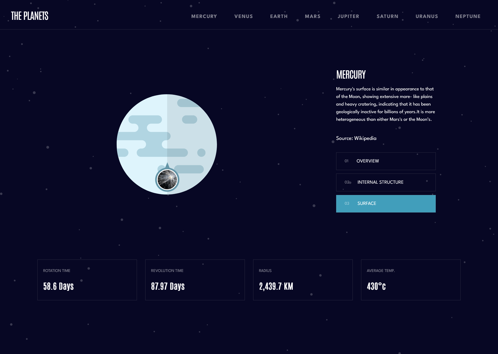
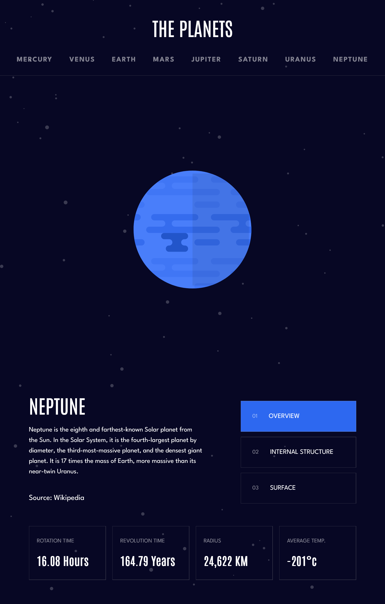

# Frontend Mentor - Planets fact site solution

## Table of contents

- [Overview](#overview)
  - [The challenge](#the-challenge)
  - [Screenshot](#screenshot)
- [My process](#my-process)
  - [Built with](#built-with)
  - [What I learned](#what-i-learned)
  - [Continued development](#continued-development)
  - [Useful resources](#useful-resources)
- [Author](#author)

## Overview

### The challenge

Users should be able to:

- View the optimal layout for the app depending on their device's screen size
- See hover states for all interactive elements on the page
- View each planet page and toggle between "Overview", "Internal Structure", and "Surface Geology"

### Screenshot

## My process

### Built with

SCSS

- Grid
- Flexbox

Javascript

- [AngularJS](https://angularjs.org/) - JS library

### What I learned

## Technical

I learned how to use CSS Grid in conjunction with Flexbox to really do some CSS jiu-jitsu and move around pieces of
a designed grid by using grid-template-areas property with media queries. I don't know if it's the proper thing to do
to design the thing but Grid in conjunction with Flexbox offers ultimate flexibility in designing UI (possibly at cost
of readability).

I also learned some new directives in SCSS such as the @each which makes implementing something that has a static design
very easily. We just simply iterate through a map and generate the CSS classes dynamically such as mercury-color,
venus-color etc and save a lot of lines of CSS.

## Funsies

I incidentally learned about planets and their relative sizes. The assets were provided similar in size and the implementation
was open ended.

I am not an astronomer but Jupiter seems to be the biggest.

## Post-Mortem

I spent about 2 hours per day over the course of 3 days. As I reflect on it it's actually more time I want to admit to making
it but I had a tough time figuring out how to effectively implement planet sizes across different screen sizes without having
to write CSS styles individually.

Using AngularJS was definitely overkill for this project but it simplified and shortened the time to develop through the use
of attribute directives. Using AngularJS also allows for the app to scale and utilize public API's such as some astronomy API's due to the use 
of RxJS / Observables so that it can be adapted to something more interesting. I stuck all the planet facts into an Angular Service 
keeping this possibilty in mind.

I spent an embarassing amount of time looking for 'Spartan' font-family and just stuck with using 'League Spartan' offered
on Google Fonts. It rendered a lot of the design documents to be less than useful and I had to eyeball a lot of the design
instead of simply just implementing the Figma design since the line heights and such either exceeded the size of a flexbox
or was too tiny to see for the user.

## Mistakes:

Design is not 1-to-1 to the Figma / Design file. I couldn't find the necessary font within a reasonable amount of time and
some designs don't map to the file as to not spend too much overdesigning simple components. eg: hamburger-nav has spacing
that looks reasonable to me but doesn't map 1-to-1 with the file.

### Continued development

Can definitely fix typography and improve the visuals of the hamburger-nav and the planet surface indicator. The indicator
moves off the center of the image on very large screen resolutions and very tiny ones even with min-width set.

### Useful resources

- [A Complete Guide to Grid](https://css-tricks.com/snippets/css/complete-guide-grid/) - This is a great resource for very commonly used CSS tricks. I find something I've never seen there in almost every challenge.

## Author

- Github - [Link to my frontendmentor challenge solutions](https://github.com/zoren2/frontendmentor)
