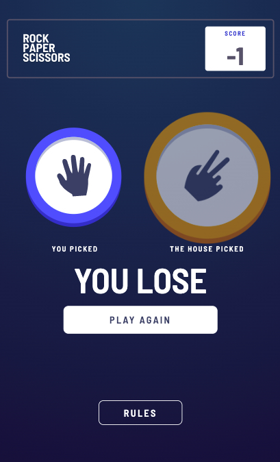

# Frontend Mentor Challenge - Rock, Paper, Scissors

## Table of contents

- [Overview](#overview)
  - [The challenge](#the-challenge)
  - [Screenshot](#screenshot)
  - [Links](#links)
- [My process](#my-process)
  - [Built with](#built-with)
  - [What I learned](#what-i-learned)
  - [Continued development](#continued-development)
  - [Useful resources](#useful-resources)
- [Author](#author)
- [Acknowledgments](#acknowledgments)

## Overview

### The challenge

Users should be able to:

- View the optimal layout for the game depending on their device's screen size
- Play Rock, Paper, Scissors against the computer
- Maintain the state of the score after refreshing the browser _(optional)_
- **Bonus**: Play Rock, Paper, Scissors, Lizard, Spock against the computer _(optional)_

### Screenshot

Mobile design

### Links

- Solution URL: [Add solution URL here](https://your-solution-url.com)
- Live Site URL: [Add live site URL here](https://your-live-site-url.com)

## My process

### Built with

- Semantic HTML5 markup
- CSS custom properties
- Flexbox
- Mobile-first workflow
- [Angular](https://angular.io/) - JS Framework library

### What I learned

I learned that managing race conditions for a simple project is an interesting task. I managed
in this case for a simple rock-paper-scissors game yet it is a learn in progress. Using
Angular compared to vanilla JS more than likely added a few extra get/set functions that make it
a little over complicated for the task but was a good "excuse" to learn a JS framework!

I learned to manage component state and making them responsive on a plethora of devices. A powerhouse
to accomplish this was the powerful CSS function clamp().

### Continued development

Modifying DOM elements directly using .nativeElement is very likely not kosher in a security sensitive application.
Moving state modification to a Angular renderer2 seems to be an easy fix but continues to bloat a relatively simple
project.

**Note: Delete this note and the content within this section and replace with your own plans for continued development.**

### Useful resources

- [Mozilla Web Docs](https://developer.mozilla.org/en-US/docs/Web/CSS/clamp) - Incredible resource and reference for CSS Functions.
- [CSS Tricks](https://css-tricks.com/min-max-and-clamp-are-css-magic) - Mind bending CSS Jiu Jitsu!
